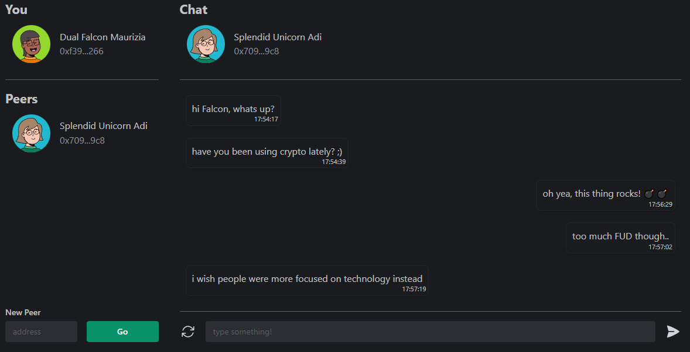

  

# Blockchatting

**A decentralized chatting application where each message is a transaction**.

Although a [deprecated functionality of MetaMask](https://medium.com/metamask/metamask-api-method-deprecation-2b0564a84686), this application uses [`eth_decrypt`](https://docs.metamask.io/guide/rpc-api.html#eth-decrypt-deprecated) and [`eth_getEncryptionPublicKey`](https://docs.metamask.io/guide/rpc-api.html#eth-getencryptionpublickey-deprecated) to use asymmetric encryption for the messages. ([see also](https://betterprogramming.pub/exchanging-encrypted-data-on-blockchain-using-metamask-a2e65a9a896c))

There are two drawbacks to these functions: `eth_decrypt` and `eth_getEncryptionPublicKey` asks for user input everytime it is called, and encryption is done for UTF-8 only. So, an EOA keypair should not be used for chatting per se. Instead, the user will generate a public-private key pair and store the encrypted secret on-chain: on first use, the user will encrypt this secret with their own EOA public key (via MetaMask RPC). On later usage, the user can retrieve the stored encrypted key and decrypt it with their EOA key.

With this approach, no keys are exposed. As for the messaging itself, a secret key is created. Say Alice is talking to Bob, Alice will create the secret and store two copies of this secret: one encrypted with Alice's public key and the other encrypted with Bob's public key. This secret will be used to encrypt and decrypt the actual messages. For symmetric encryption we use AES256, and for asymmetric encryption we use ECIES (secp256k1).

Deterministically random avatars and names are generated from addresses. These are not customisable, and are for UI purposes alone. Furthermore, it is easier for a user to recognize a peer w.r.t their avatar & name rather than their address. Here is what a chat session looks like:

## Usage

There are scripts ready within `package.json`:

- First, `yarn node:start` in a terminal to start your node.
- Then, `yarn node:prep` to deploy the contract.
- Finally, run `yarn dev` to start a local development server.

## User Initialization

The first time a user starts the application a key-pair is generated to be used for chatting alone, and the secret to generate this keypair is encrypted with EOA public key. These are stored in the smart contract:

```mermaid
sequenceDiagram
  actor Alice
  actor Contract

  Note over Alice: pk_eoa := eth_getEncryptionPublicKey(Alice)
  Note over Alice: s := randomBytes(32)
  Note over Alice: sk_chat, pk_chat := keygen(s)
  Note over Alice: sk_chat_enc := encrypt_metamask(pk_eoa, sk_chat)

  Alice ->> Contract: sk_chat_enc, pk_chat

  Note over Alice, Contract: Some time later...

  Contract ->> Alice: sk_chat_enc
  Note over Alice: sk_chat := decrypt_metamask(sk_eoa, sk_chat_enc)

```

We use [Elliptic Curve Integrated Encryption Scheme for secp256k1](https://ecies.org/js/) for this.

## Chat Initializations

As we have shown above, the users provide their chatting public key at first setup. When two users chat for the first time, the initiator will generate a random 32-byte key, and store this in the contract both with it's own public key and the recipient's public key.

```mermaid
sequenceDiagram
  actor Alice
  actor Contract

  Note over Alice: sk_alice_bob = randomBytes(32)
  Contract ->> Alice: bob-pk_chat, alice-pk_chat
  Alice ->> Contract: chatkeys[Alice][Bob] = encrypt(sk_alice_bob, alice-pk_chat)
  Alice ->> Contract: chatkeys[Bob][Alice] = encrypt(sk_alice_bob, bob-pk_chat)
```

## End-to-End Encryption

When Alice and Bob talk to eachother, they will encrypt the messages with this secret key.

```mermaid
sequenceDiagram
  actor Alice
  actor Bob
  actor Contract

  Contract ->> Alice: sk_alice_bob_enc = chatkeys[Alice][Bob]
  Contract ->> Bob: sk_alice_bob_enc = chatkeys[Bob][Alice]

  Note over Alice: sk_alice_bob = decrypt(sk_alice_bob_enc, alice-sk_chat)
  Note over Bob: sk_alice_bob = decrypt(sk_alice_bob_enc, bob-sk_chat)

  Note over Alice: c = encrypt(sk_alice_bob, m)
  Alice ->> Bob: c
  Note over Bob: m = decrypt(sk_alice_bob, c)
```

We use [AES256](https://www.npmjs.com/package/aes256) for this.

Why not use public key encryption for messaging? There are two good reasons:

1. Alice would not be able to read her messages sent to Bob, as they are encrypted with Bob's public key.
2. Asymmetric encryption is much slower than symmetric encryption.

## Code Style

- The frontend codes are formatted & linted with respect to [Google TypeScript Styleguide](https://google.github.io/styleguide/tsguide.html) using [GTS](https://github.com/google/gts).
- SCSS codes are formatted by [SCSS Formatter](https://marketplace.visualstudio.com/items?itemName=sibiraj-s.vscode-scss-formatter).
- The contract codes are formatted with [Solidity + Hardhat](https://hardhat.org/hardhat-vscode/docs/formatting). Solidity linter is [solhint](https://protofire.github.io/solhint).
